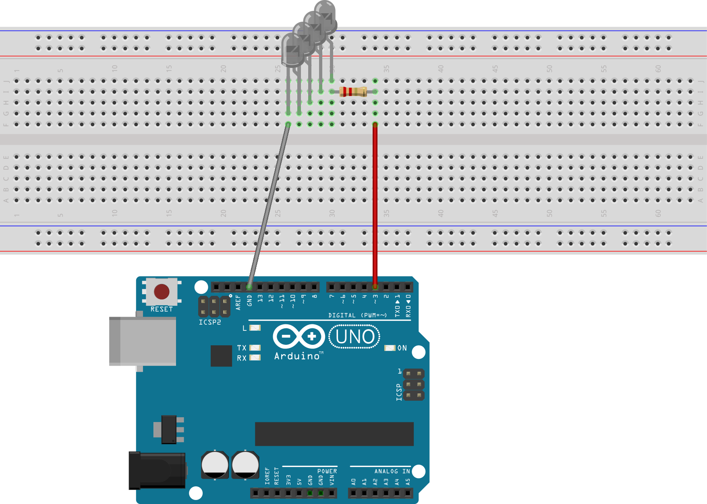

# s107g-arduino

Control an [S107G RC helicopter](https://www.amazon.com/Cheerwing-S107G-Phantom-Channel-Helicopter/dp/B0178WRTLU/)
with an Arduino board.

## Circuit and components

* Four [940nm infrared LEDs](https://bc-robotics.com/shop/5mm-infrared-led-940nm/)
* One [2.2 Ohm resistor](https://www.amazon.com/Projects-25EP5122R20-2-2-Resistors-Pack/dp/B01F5F5GH6/)
* Breadboard
* Arduino

If you have a different number of LEDs, you may want to use
[this LED calculator tool](http://www.hebeiltd.com.cn/calculator/v5/led.php). To increase the range of this circuit, you will
either need more LEDs or brighter LEDs, which will draw more current from the Arduino's pin. In such case, consider using a
transistor to drive the LEDs' power.

## Test

Upload [`S107G_Controller.ino`](./arduino/S107G_Controller.ino) to your Arduino and open the `Serial Monitor`. Turn on your
helicopter and control its throttle, yaw, pitch, or trim by sending the following commands:

* `t:X`: set throttle to `X` - any integer between 0 and 127, for example `t:50`
* `y:X`: set yaw to `X` - any integer between 0 and 127, centered at 63
* `p:X`: set pitch to `X` - any integer between 0 and 127, centered at 63
* `r:X`: set trim to `X` - any integer between 0 and 127, centered at 63

## Run

Upload [`S107G_PyController.ino`](./arduino/S107G_Controller.ino) to your Arduino and run
[`S107G_PyController.py`](./S107G_PyController.py) on your computer. Control the helicopter with your keyboard.

### Known issues

* The serial interface between the Arduino and the computer is too slow to maneuver the helicopter

## References

The code in this repository is based on the work of several people, including that of [Jim'ung](http://www.jimhung.co.uk/),
[ladyada](https://www.adafruit.com/), and [Kerry D. Wong](http://www.kerrywong.com/). Credits to all of them for reverse
engineering the controller protocol and showing how to send a 38KHz infrarred pulse using an Arduino.

Some of the sources on which I based my work are:

* [Syma S107 Arduino Driver and Python GUI Controller](https://github.com/vivin/syma)
* [jimhung.co.uk's S107G protocol](http://www.jimhung.co.uk/wp-content/uploads/2013/01/Syma107_ProtocolSpec_v1.txt)
* [Reverse Engineering the Syma S107G IR Protocol](http://www.kerrywong.com/2012/08/27/reverse-engineering-the-syma-s107g-ir-protocol/)
* [Making an Intervalometer](https://learn.adafruit.com/ir-sensor/making-an-intervalometer)

## S107G protocol

The protocol to control the RC helicopter can be found
[here](http://www.jimhung.co.uk/wp-content/uploads/2013/01/Syma107_ProtocolSpec_v1.txt). Note that this code works for the
2-channel version, if you have a 3-channel remote controller follow
[this link](http://abarry.org/s107g-helicopter-control-via-arduino/).
